# ec2-imagebuilder-ami-lifecycle

Managing the lifecycle of [AMI (Amazon Machine Image)](https://docs.aws.amazon.com/AWSEC2/latest/UserGuide/AMIs.html)s is a common requirement for many of our customers.

An AMI lifecycle can include lifecycle events such as:

* building
* verifying
* testing
* vulnerability scanning
* certifying
* approving
* patching

AWS offers the [EC2 Image Builder](https://aws.amazon.com/image-builder/) managed service that can cover many of these AMI Lifecycle requirements. EC2 Image Builder simplifies the building, testing, and deployment of Virtual Machine and container images for use on AWS or on-premises.

Keeping Virtual Machine and container images up-to-date can be time consuming, resource intensive, and error-prone. Currently, customers either manually update and snapshot VMs or have teams that build automation scripts to maintain images.

Image Builder significantly reduces the effort of keeping images up-to-date and secure by providing a simple graphical interface, built-in automation, and AWS-provided security settings. With Image Builder, there are no manual steps for updating an image nor do you have to build your own automation pipeline.

This guide, and accompanying source code, describes an approach to managing AMI lifecycles by extending the capabilities of EC2 Image Builder and offering several additional features:

* Orchestrator API to manage an AMI through its different lifecycle events
* CLI (Command Line Interface) for interacting with the Orchestrator API
* Simple UI for visualizing AMI Lifecycle status
* Integration with [AWS Inspector](https://aws.amazon.com/inspector/) for Vulnerability Scanning
* Integration with [VMImport/Export](https://aws.amazon.com/ec2/vm-import/) to allow AMIs to be exported on-premises for certification
* Lookup table to allow for AMIs to be selected according to an AMI Selection Criteria
* CLI (Command Line Interface) that uses the AMI Selection Criteria to retrieve AMIs

------

* [Solution architecture](#solution-architecture)
* [AMI Orchestrator overview](#ami-orchestrator-overview)
* [AMI Lifecycle overview](#ami-lifecycle-overview)
* [AMI Lifecycle Events](#ami-lifecycle-events)
* [API Endpoints and documentation](#api-endpoints-and-documentation)
* [AMI Selection](#ami-selection)
* [AMI Semantic Versioning](#ami-semantic-versioning)
    * [AMI Semantic Versioning for AMI Creation](#ami-semantic-versioning-for-ami-creation)
    * [AMI Semantic Versioning for AMI Patch](#ami-semantic-versioning-for-ami-patch)
* [AMI Lifecycle State Machines](#ami-lifecycle-state-machines)
    * [AMI Build State Machine](#ami-build-state-machine)
    * [AMI Smoke Tests State Machine](#ami-smoke-tests-state-machine)
    * [AMI Vulnerability Scans State Machine](#ami-vulnerability-scans-state-machine)
    * [AMI QA Certification Request State Machine](#ami-qa-certification-request-state-machine)
    * [AMI Mark for Production State Machine](#ami-mark-for-production-state-machine)
    * [AMI Patch State Machine](#ami-patch-state-machine)
* [AMI Tagging](#ami-tagging)
* [Deploying the project](#deploying-the-project)
* [Verifying the project](#verifying-the-project)
* [Testing the project](#testing-the-project)
    * [Generate an AMI via the Orchestrator API CLI](#generate-an-ami-via-the-orchestrator-api-cli)
    * [Use the Orchestrator API Timeline Visualization](#use-the-orchestrator-api-timeline-visualization)
    * [Retrieve an AMI using AMI Selection Criteria](#retrieve-an-ami-using-ami-selection-criteria)
* [Clean-up the project](#clean-up-the-project)
* [Executing unit tests](#executing-unit-tests)
* [Executing static code analysis tool](#executing-static-code-analysis-tool)
* [Troubleshooting](#troubleshooting)
    * [Troubleshooting via Logs](#troubleshooting-via-logs)
        * [API Gateway errors](#api-gateway-errors)
        * [State Machine errors](#state-machine-errors)
        * [API Receiver errors](#api-receiver-errors)
    * [SNS Push Notifications](#sns-push-notifications)
* [Security](#security)
* [License](#license)

## Solution architecture

The solution architecture is described below:

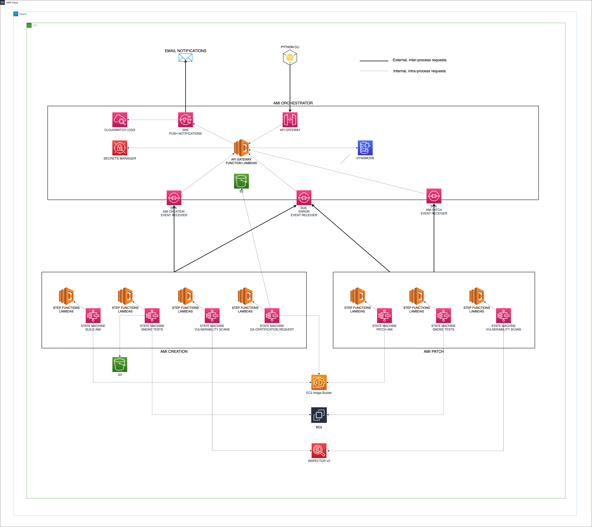

The key services of the solution architecture are referenced below:

| Service | Description |
|-----------------|:-------------|
| [EC2 Image Builder](https://aws.amazon.com/image-builder/) | EC2 Image Builder provides the capabilities to build, verify and test AMIs. |
| [AWS Inspector](https://aws.amazon.com/inspector/) | AWS Inspector is leveraged to provide vulnerability scanning of the AMIs generated by EC2 Image Builder. AWS Inspector can generate finding reports which are persisted to an S3 bucket. |
| [VMImport/Export](https://aws.amazon.com/ec2/vm-import/) | VMImport/Export is used to export an AMI to a VMDK format which is stored in a S3 bucket for download and certification on-premises. |
| [API Gateway](https://aws.amazon.com/api-gateway/) | Amazon API Gateway is a fully managed service that makes it easy for developers to create, publish, maintain, monitor, and secure APIs at any scale. APIs act as the "front door" for applications to access data, business logic, or functionality from your backend services. API Gateway is used within this solution to publish the Orchestrator API endpoints which allow a customer to interact with the AMI lifecycles. |
| [AWS Step Functions](https://aws.amazon.com/step-functions/) | AWS Step Functions is a low-code, visual workflow service that developers use to build distributed applications, automate IT and business processes, and build data and machine learning pipelines using AWS services. Workflows manage failures, retries, parallelization, service integrations, and observability so developers can focus on higher-value business logic. AWS Step Functions are used within this solution to coordinate the tasks associated with an AMI Lifecycle operation. |
| [AWS Lambda](https://aws.amazon.com/lambda/) | AWS Lambda is a serverless, event-driven compute service that lets you run code for virtually any type of application or backend service without provisioning or managing servers. You can trigger Lambda from over 200 AWS services and software as a service (SaaS) applications, and only pay for what you use. AWS Lambda is used within this solution as the compute service that executes the tasks associated with AMI Lifecycle operations as well as processing the endpoints for the Orchestrator API. |
| [AWS SQS (Simple Notification Service)](https://aws.amazon.com/sqs/) | Amazon Simple Queue Service (SQS) is a fully managed message queuing service that enables you to decouple and scale microservices, distributed systems, and serverless applications. SQS eliminates the complexity and overhead associated with managing and operating message-oriented middleware, and empowers developers to focus on differentiating work. AWS SQS is used within this solution to provide inter-process communication between the AWS Steps Functions that process AMI Lifecycle events and the AWS Lambda functions that power the Orchestrator API. |
| [AWS SNS (Simple Notification Service)](https://aws.amazon.com/sns/) | Amazon Simple Notification Service (Amazon SNS) is a fully managed messaging service for both application-to-application (A2A) and application-to-person (A2P) communication.. AWS SNS is used within this solution to publish notifications for events that occurs during the AMI lifecycles. |
| [Amazon DynamoDB](https://aws.amazon.com/dynamodb/) | Amazon DynamoDB is a fully managed, serverless, key-value NoSQL database designed to run high-performance applications at any scale. DynamoDB offers built-in security, continuous backups, automated multi-Region replication, in-memory caching, and data import and export tools. AWS DynamoDB is used within this solution to persist the data and metadata associated with AMI Lifecycle events. |
| [Amazon S3](https://aws.amazon.com/s3/) | Amazon Simple Storage Service (Amazon S3) is an object storage service offering industry-leading scalability, data availability, security, and performance. Amazon S3 is used within this solution to persist objects associated with the AMI Lifecycle events such as exported AMIs, AMI patch components and AMI backups. |
| [AWS Secrets Manager](https://aws.amazon.com/secrets-manager/) | AWS Secrets Manager helps you protect secrets needed to access your applications, services, and IT resources. The service enables you to easily rotate, manage, and retrieve database credentials, API keys, and other secrets throughout their lifecycle. AWS Secrets Manager is used within this solution to store the API Keys that secure the Orchestrator API. |

### AMI Orchestrator overview

The AMI Orchestrator provides a guided, event-driven, rules based process for creating and patching AMIs and moving those AMIs through their respective lifecycles.

* API Gateway is used to deliver the Orchestrator API endpoints.
* Amazon DynamoDB is used to persist the state of an AMI lifecycle and is the source of truth for AMI lifecycle statuses. Amazon DynamoDB is also leveraged to track the AMI Semantic Version seed as well as the AMI Lookup table that can be used to select an AMI.
* AWS Lambda functions are used as the backing functions for the API Gateway endpoints.
* AWS Secrets Manager stores API keys that are used to authenticate API requests.
* Amazon S3 is used to store patch components, api documentation, ami backups and ami exports.
* AWS SNS topics are used for AMI lifecycle event *push* notifications.
* AWS SQS queues are used as *receivers* to process the results of the AMI Lifecycle AWS Step Functions. 

  There are 3 SQS queues;

    * AMI Creation Receiver Queue
    * AMI Patch Receiver Queue
    * AMI Error Receiver Queue

### AMI Lifecycle overview

* AWS Step Functions State Machines are used to process the individual AMI lifecycle events.
* EC2 Image Builder is used by the AMI Build and AMI Patch events to generate AMIs.
* EC2 Instances are used by the Smoke Tests and Vulnerability Scans event to execute tests and scans.
* AWS Inspector is used by the Vulnerability Scans event to execute vulnerability scans against an AMI.
* VMImport/Export is used by the QA Certification Request to export an AMI to VMDK format.
* Amazon S3 is used by QA Certification Request to store the exported VMDK file and generate a pre-signed URL. Amazon S3 is also used to store a backup copy of the AMI during the Mark for Production event.

## AMI Lifecycle Events

Events define the lifecycle actions that are to be performed on an AMI.

The following AMI lifecycle events are supported for *creation* operations:

| Event                         | Description |
| ---------------               | --------------- |
| **AMI_BUILD**                 | Creates a new AMI. |
| **SMOKE_TESTS**               | Executes smoke tests against an AMI. |
| **VULNERABILITY_SCANS**       | Executes vulnerability scans against an AMI. |
| **QA_CERTIFICATION_REQUEST**  | Begins the process of QA Certification. The AMI is exported to VMDK format and published to Amazon S3 for on-site download and testing by an external QA Team. Once the VMDK image is certified, the QA team can invoke a callback URL to the Orchestrator API which will mark the AMI as *QA_CERTIFIED*. |
| **QA_CERTIFICATION_RESPONSE**  | This is the callback event received from an external QA team *certifying* the AMI as ready for production. |
| **MARK_FOR_PRODUCTION**  | Marks an AMI as ready for production usage and performs an AMI backup to an S3 bucket. |

The following AMI lifecycle events are supported for *patching* operations:

| Event                         | Description |
| ---------------               | --------------- |
| **AMI_PATCH**                 | Patches an AMI.  |
| **SMOKE_TESTS**               | Executes smoke tests against an AMI. |
| **VULNERABILITY_SCANS**       | Executes vulnerability scans against an AMI. |
| **MARK_FOR_PRODUCTION**       | Marks an AMI as ready for production usage and performs an AMI backup to an S3 bucket. |

Events that have been successfully completed are immutable. An event that has been completed successfully cannot be reprocessed. For example, if an AMI has successfully completed the `SMOKE_TESTS` event then attempts to reprocess this event will result in an API error.

Events must be completed in a specified sequence. The Orchestrator API contains business rules to ensure that events are processed sequentially. The events, as presented in the tables above, are shown in their correct sequence order.

The concept behind the sequence order is that we would not want to certify an AMI (`QA_CERTIFICATION` event) or mark an AMI as ready for production (`MARK_FOR_PRODUCTION` event) if that AMI had not already passed through some prerequisite checks such as smoke tests and vulnerability scans (`SMOKE_TESTS` and `VULNERABILITY_SCANS` respectively).

## API Endpoints and documentation

The AMI Orchestrator API is created via an [OpenAPI 3 specification](https://swagger.io/specification/) YAML file.

The [ami-orchestrator-api.yaml](stacks/amilifecycle/resources/lambda/api_creator/api_definition/ami-orchestrator-api.yaml) API specification file acts as both definition and documentation.

Documentation for the AMI Orchestrator API can be *exported* from the API Gateway as per the instructions described in [Export a REST API from API Gateway](https://docs.aws.amazon.com/apigateway/latest/developerguide/api-gateway-export-api.html#api-gateway-export-api-from-console). Once the Orchestrator API specification has been exported to a file, that exported file can be imported into the [Swagger UI Editor](https://editor.swagger.io/) for visualization.

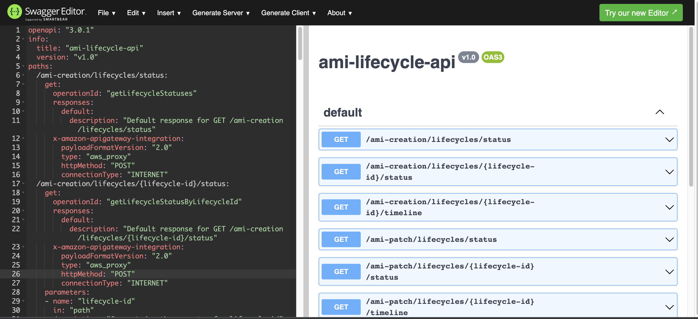

## AMI Selection

The AMI Orchestrator maintains a DynamoDB *lookup* table that persists metadata related to an AMI.

| Metadata         | Description | Example | 
|---------------    |-----------------|-----------------|
| ami_semver        | The semantic version associated with the AMI.  | 1.0.0      |
| aws_region        | The aws region where the AMI is shared.        | us-east-1     |
| lifecycle_event   | The latest completed lifecycle event.       | MARK_FOR_PRODUCTION             |
| lifecycle_type    | The type of lifecycle.         | ami-creation            |
| stack_tag         | The stack tag associated with the AMI.        | main            |
| product_name      | An arbitrary identifier that can be used to *name* the product associated with an AMI.        | My Product Name             |
| product_ver       | A product version to be associated with the AMI.         | 1.0.0             |

This metadata can then be used to select an appropriate AMI according to a selection criteria.

A CLI (Command Line Interface) client has been created to allow for testing AMI Selection.

See the [AMI Selection CLI README.md](client/README.md) file for complete details and examples of configuring and using the AMI Selection CLI.

## AMI Semantic Versioning

The AMI Orchestrator supports [semantic versioning](https://semver.org/) of AMIs.

AMI semantic versioning is *metadata* associated with the AMI and is persisted into the DynamoDB `AmiLookup` table.

During an AMI Creation event, the AMI semantic version will receive a *MAJOR* bump. The current AMI semantic version is tracked via the DynamoDB `AmiSemverSeed` table. 

### AMI Semantic Versioning for AMI Creation

When a new AMI is created via the AMI Orchestrator:

1. the current semantic version will be grabbed from the DynamoDB `AmiSemverSeed` table
2. the retrieved semantic version receives a *MAJOR* bump
3. the *bumped* semantic version is associated with the new AMI and persisted to the DynamoDB `AMiLifecycleState` and `AmiLookup` tables
4. the *bumped* semantic version becomes the current semantic version seed and is persisted to the DynamoDB `AmiSemverSeed` table

### AMI Semantic Versioning for AMI Patch

When an existing AMI is patched via the AMI Orchestrator:

1. the current semantic version will be grabbed from the existing AMI metadata
2. the patch operation requires that a user defines whether the patch is a *MINOR* or *PATCH* bump
3. the *bumped* semantic version is associated with the patched AMI and persisted to the DynamoDB `AMiLifecycleState` and `AmiLookup` tables

## AMI Lifecycle State Machines

The AMI Lifecycle events are powered by AWS Step Functions State Machines.

Each lifecycle event is powered by an independent State Machine.

### AMI Build State Machine

Executes an EC2 Image Builder Image Pipeline which creates an AMI based on an Image Recipe and Image Components defined in EC2 Image Builder.

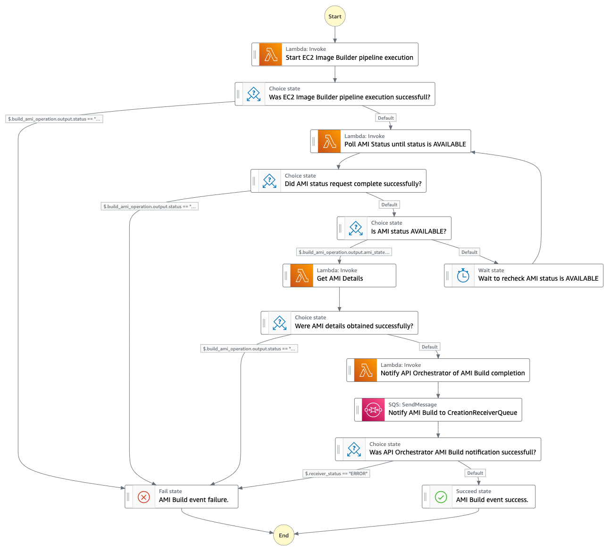

### AMI Smoke Tests State Machine

Executes a series of smoke tests against a new or patched AMI.

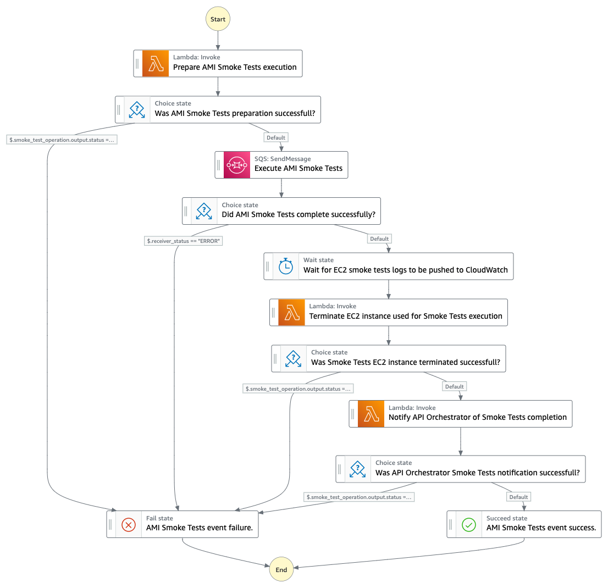

### AMI Vulnerability Scans State Machine

Invokes vulnerability scans, via AWS Inspector, by launching an EC2 instance that uses a new or patched AMI.

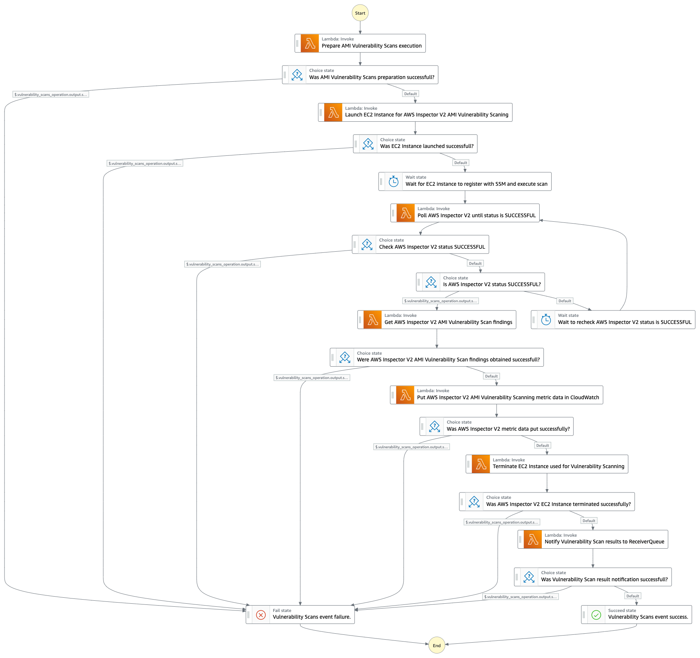

### AMI QA Certification Request State Machine

Executes the process of a QA Certification request. The AMI is exported to VMDK format and published to S3 for on-site download and testing by an external QA Team.

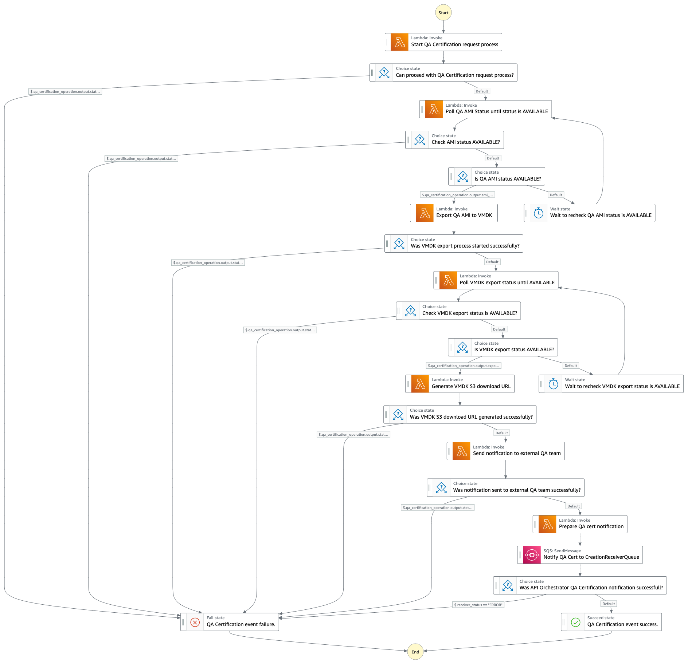

### AMI Mark for Production State Machine

Marks an AMI as ready for production usage and creates a backup of the AMI in an S3 bucket.

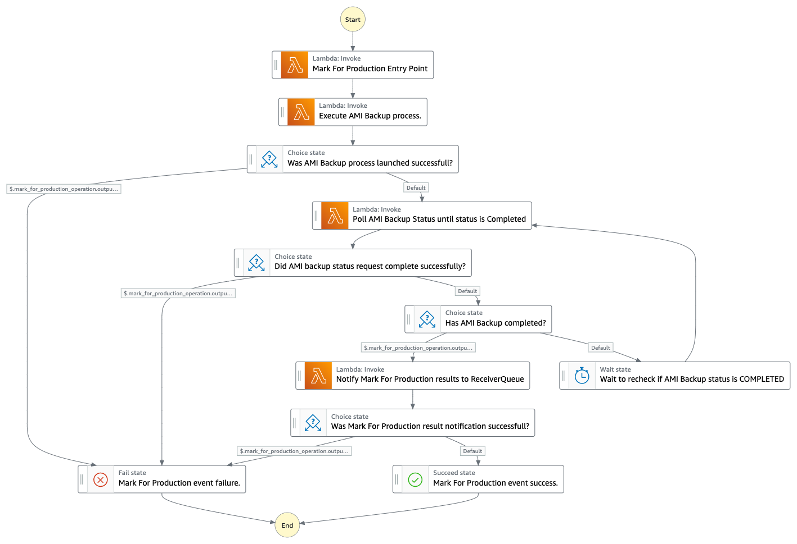

### AMI Patch State Machine

Executes a new EC2 Image Builder pipeline, using a provided patch component. The output of this step functions is a new, patched AMI using the previous patched (or new AMI) as a parent image.

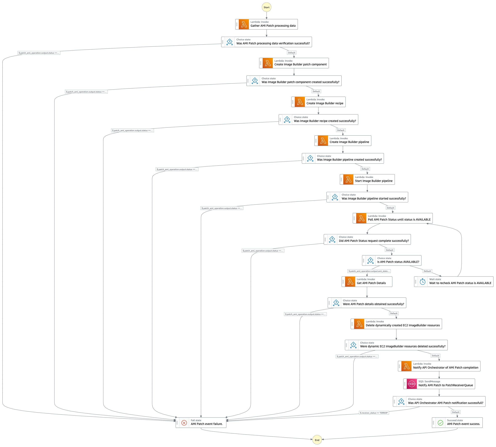

## AMI Tagging

As an AMI passes through an AMI Lifecycle event, the metadata associated with that event is persisted to DynamoDB. This metadata can be viewed at any time via the `get_status_by_lifecycle_id` function of the [Orchestrator API CLI](stacks/amilifecycle/resources/cli/README.md).

As a convenience, the key elements of an AMI Lifecycle event are written to the `tags` of an AMI, as shown in the example below:

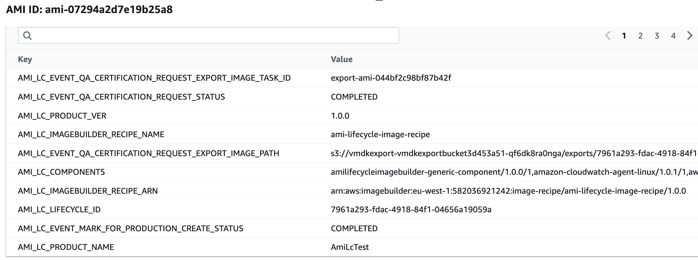

## Deploying the project

The project code uses the Python flavour of the AWS CDK ([Cloud Development Kit](https://aws.amazon.com/cdk/)). In order to execute the project code, please ensure that you have fulfilled the [AWS CDK Prerequisites for Python](https://docs.aws.amazon.com/cdk/latest/guide/work-with-cdk-python.html).

Additionally, the project assumes:

* configuration of [AWS CLI Environment Variables](https://docs.aws.amazon.com/cli/latest/userguide/cli-configure-envvars.html).
* the availability of a `bash` (or compatible) shell environment.

The project code requires that the AWS account is [bootstrapped](https://docs.aws.amazon.com/de_de/cdk/latest/guide/bootstrapping.html) in order to allow the deployment of the CDK stack.

```bash
# navigate to project directory
cd ec2-imagebuilder-ami-lifecycle

# install and activate a Python Virtual Environment
python3 -m venv .env
source .env/bin/activate

# install dependant libraries
pip install -r requirements.txt

# bootstrap the account to permit CDK deployments
cdk bootstrap
```

Upon successful completion of `cdk bootstrap`, the project is ready to be deployed.

A utility script is available that will prepare the AWS account for deployment and will execute the `cdk deploy` command.

The script can be executed with the command shown below.

```
bash deploy.sh
```

**NOTE:** The deploy script will enable AWS Inspector for EC2 Scanning in the target AWS Account. All accounts new to AWS Inspector are eligible for a 15-day free trial to evaluate the service and estimate its cost. During the trial, all eligible Amazon Elastic Compute Cloud (EC2) instances and container images pushed to Amazon Elastic Container Registry (ECR) are continually scanned at no cost. See [AWS Inspector pricing information](https://aws.amazon.com/inspector/pricing/) for the latest pricing details. During the deploy script, you will be prompted to accept the enabling of AWS Inspector for EC2 scanning. The deploy script will also prompt you to confirm the creation of AWS resources.

## Verifying the deployment

Following a successful deployment, verify that 6 (six) new stacks have been created within the AWS account:

* `AmiLifecycle`
* `AmiLifecycleImageBuilder`
* `VmdkExport`
* `AmiLifecycleTagger`
* `AmiLifecycleNetwork`
* `CDKToolkit`

Log into the AWS Console → navigate to the CloudFormation console:

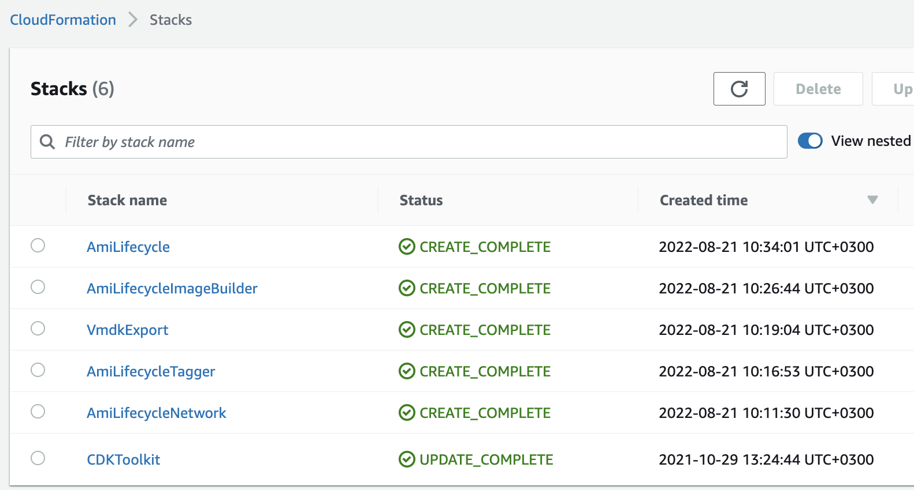

## Testing the project

The project should be tested in 3 steps:

1. Use the [Orchestrator API CLI](stacks/amilifecycle/resources/cli/README.md) to generate an AMI and progress that AMI through its various lifecycle events.
2. Use the Orchestrator API Timeline Visualization to monitor the AMI lifecycle event progress.
3. Use the [AMI Selection CLI](client//README.md) to retrieve an AMI ID using an AMI Selection Criteria.

### Generate an AMI via the Orchestrator API CLI

The Orchestrator API can be inconvenient to work with directly as there are several boilerplate prerequisites required and it is necessary to have knowledge of the API JSON payload formats.

For this reason, the `ec2-imagebuilder-ami-lifeycle` project provides an [Orchestrator API CLI](stacks/amilifecycle/resources/cli/README.md)(Command Line Interface) which is a convenient interface to process AMI's through their respective lifecycle events.

It is highly recommended that you read the [Orchestrator API CLI README](stacks/amilifecycle/resources/cli/README.md) file as this explains the full use of the CLI. However, for convenience, basic CLI usage instructions are provided below.

The CLI is a Python application. It is best practice to create a Virtual Environment and install `pip` dependencies as shown below:

```bash
# navigate to the CLI application
cd stacks/amilifecycle/resources/cli

# create a virtual env
python3 -m venv .env

# activate the virtual env
source .env/bin/activate

# install pip dependencies
pip install -r requirements.txt
```

With the Python Virtual Environment created and the dependencies installed, you are now ready to execute an AMI build request.

Before executing requests, ensure that your [AWS CLI environment variables](https://docs.aws.amazon.com/cli/latest/userguide/cli-configure-envvars.html) have been configured correctly.

Change the following argument values if desired:

* `stackTag` - if not `main`
* `owner` - add your name if desired
* `productVer` - add your desired product version
* `productName` - add your desired product name
* `notifications` - add your desired email address

```
python api-cli.py \
    --mode "BATCH" \
    --operation "AMI_CREATE" \
    --stackTag "main"  \
    --events "AMI_BUILD_ONLY" \
    --owner "ownername" \
    --productVer "1.0.0" \
    --productName "My Product Name" \
    --notifications "EMAIL::user@domain.com"
```

The AMI Build request will return an AMI Lifecycle Id. The AMI Lifecycle Id is in the [UUID](https://en.wikipedia.org/wiki/Universally_unique_identifier) format (e.g. 2b4c443f-44fe-442f-a233-32fb5dac5e2c). We can use the returned AMI Lifecycle Id to grab the API status link for this AMI Lifecycle request.

Change the following argument values:

* `lifecycleId` - change to the `lifecycleId` returned by the AMI Build request
* `stackTag` - if not `main`
* `owner` - add your name if desired
* `notifications` - add your desired email address

```bash
python api-cli.py \
    --mode "BATCH" \
    --operation "AMI_GET_STATUS_BY_LIFECYCLE_ID" \
    --stackTag "main" \
    --lifecycleId "2b4c443f-44fe-442f-a233-32fb5dac5e2c" \
    --owner "ownername" \
    --notifications "EMAIL::user@domain.com"
```

The AMI Status request will return a AMI Status link that can be copied and pasted into a browser (Mozilla Firefox is recommended as it pretty prints the JSON response).


### Use the Orchestrator API Timeline Visualization

Now that an AMI Build request has been invoked, it is useful to visualize the progress of the AMI as it moves through its various lifecycle events.

The Orchestrator API Timeline Visualization provides a simple UI that shows key details of the AMI Lifecycle. It also provides a timeline graphic showing which AMI Lifecycle events the AMI has completed and which AMI Lifecycle events are still remaining to be completed.

There are two ways to access the link to the Orchestrator API Timeline Visualization:

1. Find the link via the `timeline.api_creation` attribute of the Orchestrator API Status json
2. Use the Orchestrator API to retrieve the Timeline Visualization link

A sample command to retrieve the Timeline Visualization link is provided below:

Change the following argument values:

* `lifecycleId` - change to the `lifecycleId` returned by the AMI Build request
* `stackTag` - if not `main`
* `owner` - add your name if desired
* `notifications` - add your desired email address

```bash
python api-cli.py \
    --mode "BATCH" \
    --operation "AMI_TIMELINE_CREATE" \
    --stackTag "main" \
    --lifecycleId "2b4c443f-44fe-442f-a233-32fb5dac5e2c" \
    --owner "ownername" \
    --notifications "EMAIL::user@domain.com"
```

The Timeline Visualization request will return a Timeline Visualization link that can be copied and pasted into your preferred browser.

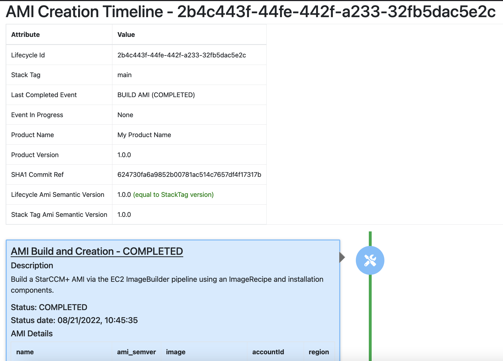

### Retrieve an AMI using AMI Selection Criteria

The AMI Orchestrator maintains a DynamoDB *lookup* table that persists metadata related to an AMI.

An [AMI Selection CLI](client/README.md) utility is provided that will allow you to:

* select the latest available AMI (default behavior)
* select an AMI via specific lookup parameters such as `ami_semver`, `product_name` etc.

It is highly recommended that you read the [AMI Selection CLI README](client/README.md) file as this explains the full use of the CLI. However, for convenience, basic CLI usage instructions are provided below.

The CLI is a Python application. It is best practice to create a Virtual Environment and install `pip` dependencies as shown below:

```bash
# navigate to the CLI application
cd client

# create Python virtual env
python3 -m venv .env

# activate the virtual env
source .env/bin/activate

# install the dependant libraries
pip install -r cli-requirements.txt
```

With the Python Virtual Environment created and the dependencies installed, you are now ready to execute an AMI Selection.

Before executing requests, ensure that your [AWS CLI environment variables](https://docs.aws.amazon.com/cli/latest/userguide/cli-configure-envvars.html) have been configured correctly.

**NOTE:** ensure that you have [generated at least one AMI via the Orchestrator API](#generate-an-ami-via-the-orchestrator-api-cli).

```
bash get_ami.sh
```

AMI Selection script output example:

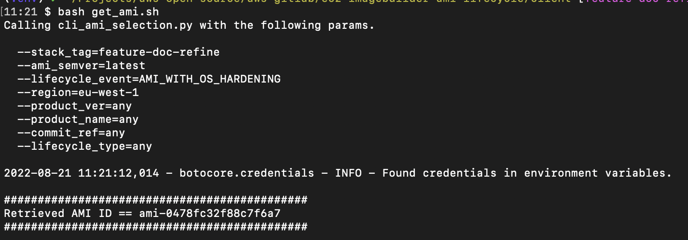

## Clean-up the project

Project clean-up is a 2 step process:

1. Destroy the CDK stacks.
2. Delete the *CDKToolkit* stack from CloudFormation.

The CDK stack and associated resources can be destroyed with the command below:

```
bash destroy.sh
```

**NOTE:** The destroy script will prompt you to confirm/deny disabling AWS Inspector for EC2 Scanning in the target AWS Account. See [AWS Inspector pricing information](https://aws.amazon.com/inspector/pricing/) for the latest pricing details. The destroy script will also prompt you to confirm the deletion of AWS resources.

When the `destroy.sh` script has completed, the final clean-up task is to delete the CDKToolkit CloudFormation stack.

1. Log into the AWS Console → navigate to the *CloudFormation* console.
2. Navigate to *Stacks*.
3. Select the **CDKToolkit**.
4. Click the *Delete* button.

## Executing unit tests

Unit tests for the project can be executed via the commands below:

```bash
python3 -m venv .env
source .env/bin/activate
rm -fr cdk.out && cdk synth && python -m pytest -v -c ./tests/pytest.ini
```

## Executing static code analysis tool

The solution includes [Checkov](https://github.com/bridgecrewio/checkov) which is a static code analysis tool for infrastructure as code (IaC).

The static code analysis tool for the project can be executed via the commands below:

```bash
python3 -m venv .env
source .env/bin/activate
rm -fr cdk.out && cdk synth && checkov --config-file checkov.yaml
```

**NOTE:** The Checkov tool has been configured to skip certain checks.

The Checkov configuration file, [checkov.yaml](checkov.yaml), contains a section named `skip-check`.

```
skip-check:
- CKV_AWS_18  # Ensure the S3 bucket has access logging enabled
- CKV_AWS_45  # Ensure no hard-coded secrets exist in lambda environment
- CKV_AWS_107 # Ensure IAM policies does not allow credentials exposure
- CKV_AWS_108 # Ensure IAM policies does not allow data exfiltration
- CKV_AWS_109 # Ensure IAM policies does not allow permissions management without constraints
- CKV_AWS_111 # Ensure IAM policies does not allow write access without constraints
- CKV_AWS_115 # Ensure that AWS Lambda function is configured for function-level concurrent execution limit
- CKV_AWS_116 # Ensure that AWS Lambda function is configured for a Dead Letter Queue(DLQ)
- CKV_AWS_117 # Ensure that AWS Lambda function is configured inside a VPC
- CKV_AWS_119 # Ensure DynamoDB Tables are encrypted using a KMS Customer Managed CMK
- CKV_AWS_158 # Ensure that CloudWatch Log Group is encrypted by KMS  
- CKV_AWS_173 # Check encryption settings for Lambda environmental variable
```

These checks represent best practices in AWS and should be enabled (or at the very least the security risk of not enabling the checks should be accepted and understood) for production systems. 

In the context of this solution, these specific checks have not been remediated in order to focus on the core elements of the solution.

## Troubleshooting

The AMI Orchestrator is a distributed implementation with many moving parts. It is an asynchronous, event-driven design. When everything works, happy days! When something goes wrong, it is important to know where to look to determine the issue. This section will describe the log files, services and troubleshooting tips to help you solve common issues with the AMI Orchestrator.

### Troubleshooting via Logs

They are 3 *categories* of Cloudwatch log files that are critical for determining the cause of AMI Orchestrator issues:
    
1. API Gateway logs
2. State Machine logs
3. API Receiver logs

#### API Gateway errors

An API Gateway error is defined as any 40X or 50X HTTP response as a result of calling the AMI Orchestrator API. Each API Gateway endpoint is backed by a lambda. Each lambda has its own Cloudwatch LogGroup.

To find the specific Cloudwatch LogGroup for the specific API Gateway route, do the following:

1. Open the AWS API Gateway console
2. Select the `AmiLifecycle` API
3. In the left hand menu, select `Develop` -> `Integrations`
4. Select the API route that corresponds to the API endpoint where the error occurred
5. You will then have the chance to navigate to the backing Lambda function
6. In the Lambda console, select the `Monitoring` tab and then `View logs in Cloudwatch`

#### State Machine errors

If an API Gateway call finishes in a 200 HTTP response, that normally indicates that the API call has worked successfully. The next step, depending on the type of API call, is an asynchronous State Machine invocation. At this point, all control is passed to the State Machine. 

The AMI Orchestrator API contains a *status* endpoint. This endpoint will show which event is currently in progress, including the arn of the State Machine that is providing the execution. See the [AMI Orchestrator CLI](stacks/amilifecycle/resources/cli/README.md) for details on how to access the *status* endpoint.

To troubleshoot a State Machine, do the following:

1. Open the AWS Step Functions console
2. Select `State Machines`
3. Select the State Machine that relates to the request operation
4. The specific State Machine view will show you the execution history. Look for a State Machine that is in the Running or Failed state
5. Select the desired execution
6. From the execution view, you can see if a step on the State Machine has failed. The execution log that appears underneath the State Machine definition provides links to the backing Lambda functions and their corresponding Cloudwatch logs

#### API Receiver errors

When a State Machine either finishes successfully or terminates in error, a SQS message is sent to a corresponding *receiver* SQS Queue, which has a corresponding Lambda subscription within the AMI Orchestrator.

There are 3 receiver Lambdas:

1. `ApiCreateReceiver`
2. `ApiPatchReceiver`
3. `ApiErrorReceiver`

If a State Machine has completed successfully but the AMI Orchestrator indicates that the event has not completed then chances are there is an error in the relevant receiver.

1. Open the AWS Lambda console
2. Find the relevant Lambda by name (as shown above)
3. Select the Lambda function
6. In the Lambda console, select the `Monitoring` tab and then `View logs in Cloudwatch`

### SNS Push Notifications

The Orchestrator AMI provides a SNS topic that is used for push notifications for lifecycle events, orchestrator actions and application errors.

By default, a Lambda is subscribed to the SNS topic and writes the push events to LogGroup:
* `/ami-lifecycles/event-notifications/{LIFECYCLE_ID}`

In addition to the Lambda subscription, when calling the Orchestrator API, it is possible to provide an email address which will ensure that push notifications are emailed to the provided email address. See the [AMI Orchestrator CLI](stacks/amilifecycle/resources/cli/README.md) for details on how to provide en email address for notifications.

**IMPORTANT**: The SNS Topic uses subscription filters to ensure that push notifications are targeted to the lifecycles that you are interested in. AWS services such as Amazon SNS use a distributed computing model called eventual consistency. Additions or changes to a subscription filter policy require up to 15 minutes to fully take effect. This means that you may occasionally miss the first push notification message. This first message notifies you that a AMI Creation request has been made. Given that AMI creation takes more than 30 minutes, all subsequent notifications for the remainder of the AMI lifecycle will be received. If you need to check the status of an AMI creation event, use the Orchestrator API status endpoint.

# Security

See [CONTRIBUTING](CONTRIBUTING.md#security-issue-notifications) for more information.

# License

This library is licensed under the MIT-0 License. See the LICENSE file.