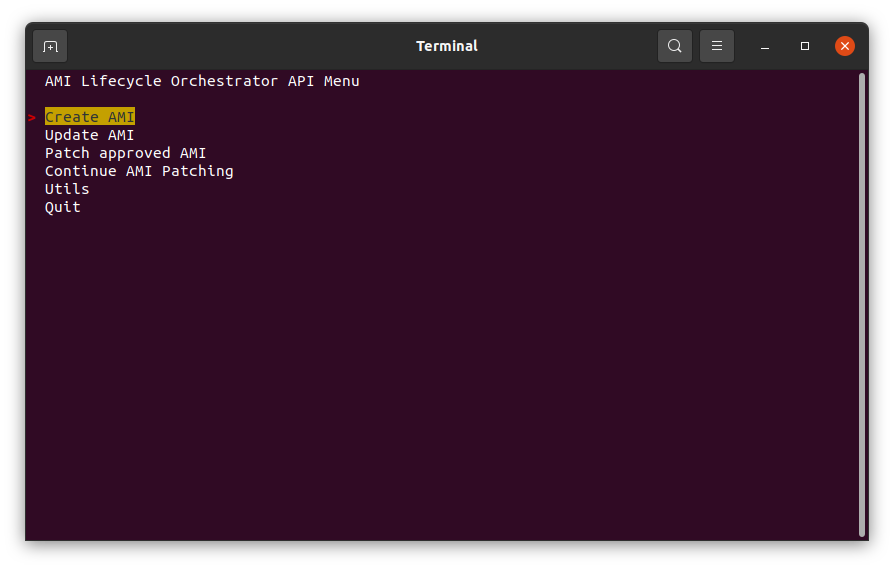
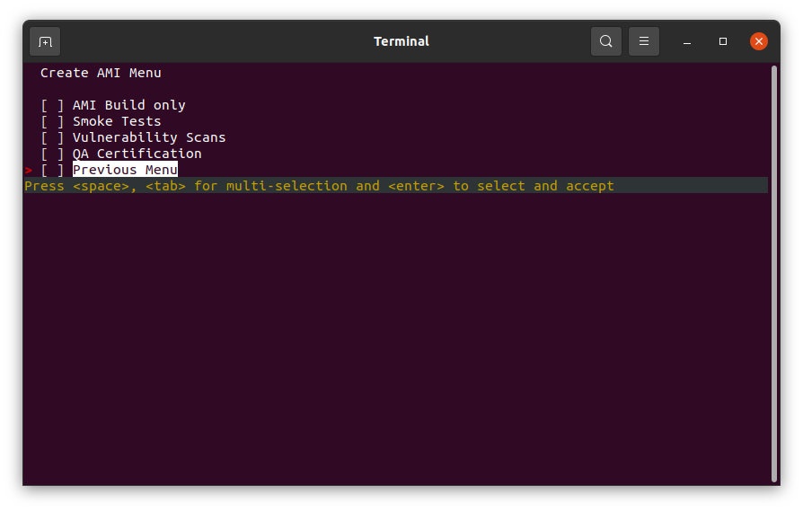
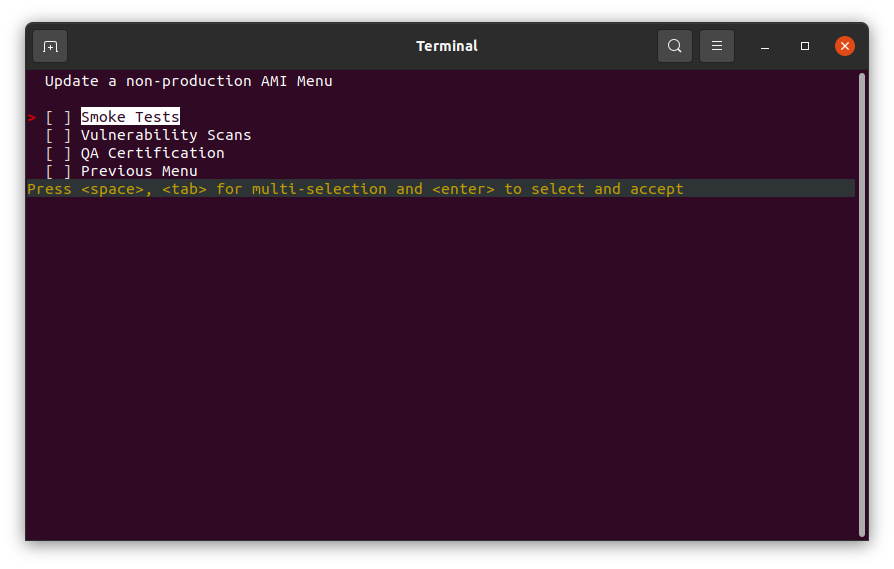
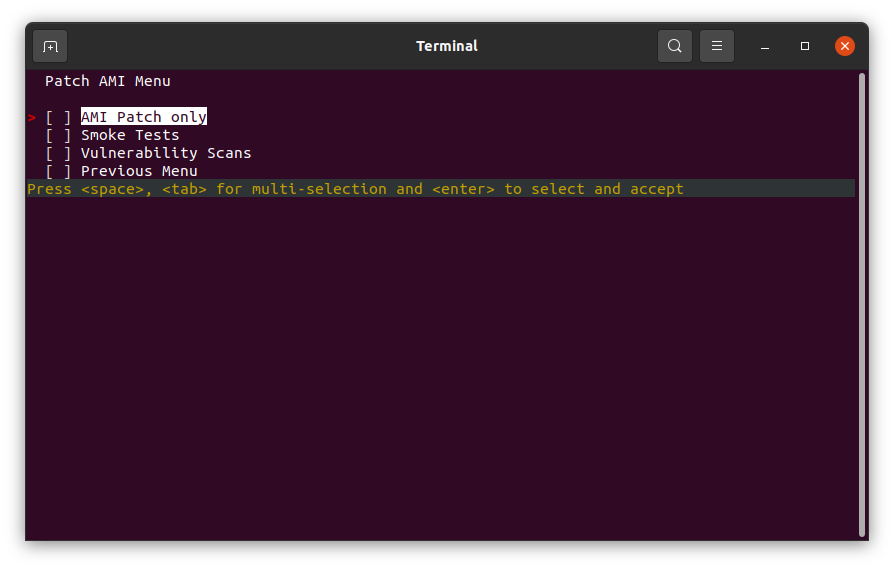
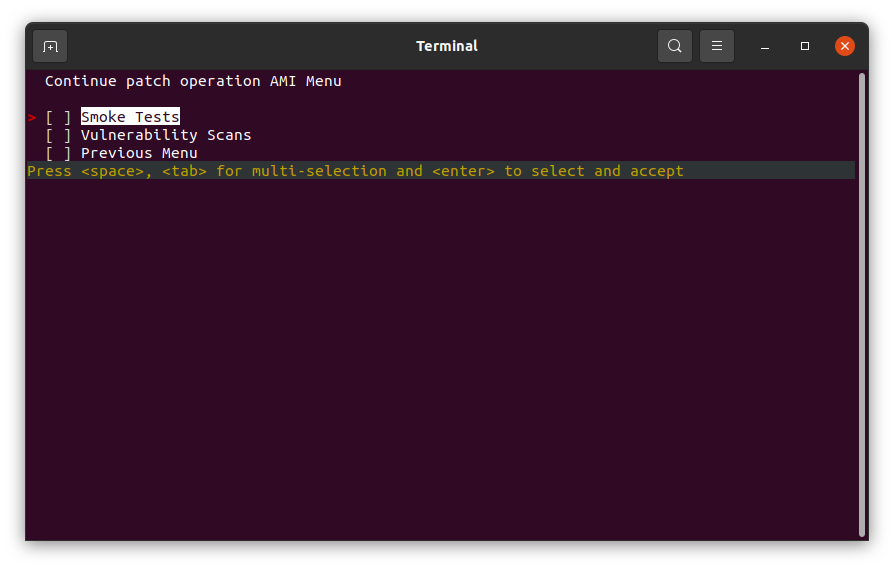
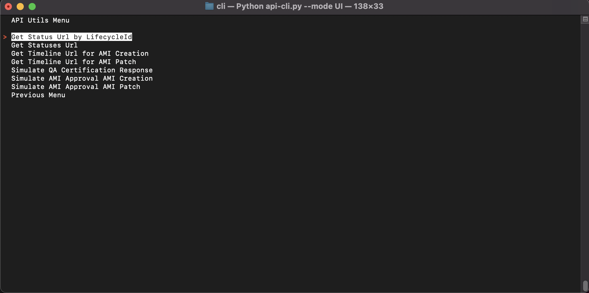

# AMI Lifecycle Orchestrator API CLI

The `ec2-imagebuilder-ami-lifeycle` project introduces the concept of an AMI Lifecycle. 

An AMI needs to pass through a series of lifecycle events in order to create a production ready AMI or patch an existing production AMI.

An Orchestrator API has been created to process AMIs through their respective lifecycle events.

The Orchestrator API can be inconvenient to work with directly as there are several boilerplate prerequisites required and it is necessary to have knowledge of the API JSON payload formats.

For this reason, a Python CLI (Command Line Interface) has been provided in order to simplify the use of the Orchestrator API and allow API consumers to focus on the business functionality of the AMI lifecycle rather than the low-level usage of the API.

The Python CLI can be used in two modes; 
    1. User Interface
    2. Scripting

* [Modes](#modes)
* [Operations](#operations)
    * [AMI Creation Operations](#ami-creation-operations)
    * [AMI Patch Operations](#ami-patch-operations)
* [Events](#events)
* [Install dependencies](#install-dependencies)
* [BATCH mode](#batch-mode)
* [BATCH Mode Usage examples](#batch-mode-usage-examples)
    * [I want to create an AMI](#i-want-to-create-an-ami)
    * [I want to update an AMI](#i-want-to-update-an-ami)
    * [I want to patch an AMI](#i-want-to-patch-an-ami)
    * [I want to continue operations on a patched AMI](#i-want-to-continue-operations-on-a-patched-ami)
    * [I want to get the status of a new or patched AMI](#i-want-to-get-the-status-of-a-new-or-patched-ami)
    * [I want to get the status of all AMI lifecycles by stack tag](#i-want-to-get-the-status-of-all-ami-lifecycles-by-stack-tag)
    * [I want to view the timeline for a new AMI](#i-want-to-view-the-timeline-for-a-new-ami)
    * [I want to view the timeline for a patched AMI](#i-want-to-view-the-timeline-for-a-patched-ami)
    * [I want to mark a new AMI as CERTIFIED by QA](#i-want-to-mark-a-new-ami-as-certified-by-qa)
    * [I want to mark a new AMI as APPROVED for production](#i-want-to-mark-a-new-ami-as-approved-for-production)
    * [I want to mark a patched AMI as APPROVED for production](#i-want-to-mark-a-patched-ami-as-approved-for-production)
* [UI mode](#ui-mode)
    * [Menu Maps](#menu-maps)
        * [AMI Lifecycle Orchestrator API Menu](#ami-lifecycle-orchestrator-api-menu)
        * [Create AMI Menu](#create-ami-menu)
        * [Update a non-production AMI Menu](#update-a-non-production-ami-menu)
        * [Patch AMI Menu](#patch-ami-menu)
        * [Continue patch operation AMI Menu](#continue-patch-operation-ami-menu)
        * [API Utils Menu](#api-utils-menu)

## Modes

The Python CLI supports 2 different modes; `UI` and `BATCH`.

| Mode              | Description |
| ---------------   | --------------- |
| **UI**            | in `UI` mode the CLI operates with an interactive User Interface. It is intended to be used by *people* and provides a guided approach to interacting with the Orchestrator API. |
| **BATCH**        | in `BATCH` mode the CLI operates as a script. Arguments are passed to the CLI which define the request and invoke the API. This mode should be used when automating interactions with the API. |

## Operations

The Python CLI supports the following operations for AMI Creation and AMI Patch lifecycles:

### AMI Creation Operations

| Operation                             | Description |
| ---------------                       | --------------- |
| **AMI_CREATE**                        | Create a new AMI |
| **AMI_CREATE_UPDATE**                 | Update an existing AMI |
| **AMI_GET_STATUS_BY_LIFECYCLE_ID**    | Get the status of a single AMI lifecycle filtered by LifecycleId |
| **AMI_GET_STATUSES**                  | Get the status of all AMI lifecycles  |
| **AMI_QA_CERTIFICATION**              | Mark an AMI as *CERTIFIED* by an external QA team |
| **AMI_APPROVAL_CREATE**               | Mark an AMI as *APPROVED* for production usage |

### AMI Patch Operations

| Operation                             | Description |
| ---------------                       | --------------- |
| **AMI_PATCH**                         | Patch a previously created AMI |
| **AMI_PATCH_UPDATE**                  | Update an existing patched AMI |
| **AMI_GET_STATUS_BY_LIFECYCLE_ID**    | Get the status of a single AMI lifecycle filtered by LifecycleId |
| **AMI_GET_STATUSES**                  | Get the status of all AMI lifecycles |
| **AMI_APPROVAL_CREATE**               | Mark an AMI as *APPROVED* for production usage |

## Events

Events define the lifecycle actions that are to be performed on an AMI.

Events that have been successfully completed are immutable. An event that has been completed successfully cannot be reprocessed. For example, if an AMI has successfully completed the `SMOKE_TESTS` event then attempts to reprocess this event will result in an API error.

Events must be completed in a specified sequence. The Orchestrator API contains business rules to ensure that the events are processed sequentially. The events, as presented in the tables below, are shown in their correct sequence order.

The concept behind the sequence order is that we would not want to certify an AMI (`QA_CERTIFICATION` event) or mark an AMI as ready for production (`MARK_FOR_PRODUCTION` event) if that AMI had not already passed through some prerequisite checks such as smoke tests and vulnerability scans (`SMOKE_TESTS` and `VULNERABILITY_SCANS` respectively).

The Python CLI supports the following events for `AMI_CREATE` operation:

| Event                         | Description |
| ---------------               | --------------- |
| **AMI_BUILD_ONLY**            | Builds an AMI only. When this option is selected it will override any other options.  |
| **SMOKE_TESTS**               | Executes smoke tests against an AMI. |
| **VULNERABILITY_SCANS**       | Executes vulnerability scans against an AMI. |
| **QA_CERTIFICATION_REQUEST**  | Begins the process of QA Certification. The AMI is exported to VMDK format and published to S3 for on-site download and testing by the QA Team. Once the VMDK image is certified, the QA team will invoke a callback URL to the API which will mark the AMI as *QA_CERTIFIED*. |

The Python CLI supports the following events for `AMI_CREATE_UPDATE` operation:

| Event                         | Description |
| ---------------               | --------------- |
| **SMOKE_TESTS**               | Executes smoke tests against an AMI. |
| **VULNERABILITY_SCANS**       | Executes vulnerability scans against an AMI. |
| **QA_CERTIFICATION_REQUEST**  | Begins the process of QA Certification. The AMI is exported to VMDK format and published to S3 for on-site download and testing by the QA Team. Once the VMDK image is certified, the QA team will invoke a callback URL to the API which will mark the AMI as *QA_CERTIFIED*. |

The Python CLI supports the following events for `AMI_PATCH` operation:

| Event                         | Description |
| ---------------               | --------------- |
| **AMI_PATCH_ONLY**            | Patches an AMI only. When this option is selected it will override any other options.  |
| **SMOKE_TESTS**               | Executes smoke tests against an AMI. |
| **VULNERABILITY_SCANS**       | Executes vulnerability scans against an AMI. |

The Python CLI supports the following events for `AMI_PATCH_UPDATE` operation:

| Event                         | Description |
| ---------------               | --------------- |
| **SMOKE_TESTS**               | Executes smoke tests against an AMI. |
| **VULNERABILITY_SCANS**       | Executes vulnerability scans against an AMI. 

## Install dependencies

As the CLI is a Python application. It is best practice to create a Virtual Environment and install `pip` dependencies as shown below:

```bash
# create a virtual env
python3 -m venv .env

# activate the virtual env
source .env/bin/activate

# install pip dependencies
pip install -r requirements.txt
```

## BATCH mode

In `BATCH` mode the CLI operates as a script. Arguments are passed to the CLI which define the request and invoke the API. This mode should be used when automating interactions with the API.

`BATCH` mode supports the following CLI arguments.

| Argument                  | Description |
| ---------------           | --------------- |
| `--mode`                  | The CLI mode. Available options; `BATCH`, `UI` |
| `--operation`             | The API operation to be performed |
| `--events`                | The AMI lifecycle events. This argument can be repeated to add multiple events. |
| `--owner`                 | The name of the person or process invoking the API. |
| `--stacktag`              | The stack tag of the branch |
| `--productVer`            | An arbitrary identifier that can be used to associate a product version label with an AMI |
| `--productName`           | An arbitrary identifier that can be used to associate a product name label with an AMI |
| `--lifecycleid`           | The AMI lifecycle id. Required for `AMI_CREATE_UPDATE`, `AMI_PATCH`, `AMI_PATCH_UPDATE` `AMI_GET_STATUS_BY_LIFECYCLE_ID`, `AMI_TIMELINE_CREATE`, `AMI_TIMELINE_PATCH` operations. |
| `--notifications`         | The channels to receive push notifications for an AMI lifecycle request. This argument can be repeated to add multiple notifications. The format of the notification is `METHOD::TARGET`. A concrete example is; `EMAIL::user@domain.com` |
| `--properties`            | Arbitrary properties that can be associated and persisted with an AMI lifecycle request. This argument can be repeated to add multiple properties. The format of the property is `KEY::VALUE`. A concrete example is; `GITLAB_PIPELINE_ID::6214F038AD` |
| `--certificationStatus`       | The result of QA certification of the AMI. Possible values are `CERTIFIED` or `FAILED` |
| `--approvalStatusAmiCreation` | Marks a new AMI as ready for production. Possible values are `APPROVED` or `FAILED` |
| `--approvalStatusAmiPatch` | Marks a patched AMI as ready for production. Possible values are `APPROVED` or `FAILED` |
| `--patchComponent` | Absolute path to a YAML file that conforms to the [EC2 Image Builder component format](https://docs.aws.amazon.com/imagebuilder/latest/userguide/create-components-cli.html). See [sample YAML component](../lambda/ami_lifecycle/app/ami_patch/samples/sample_component.yaml) |
| `--patchChangeDescription` | Textual description of the contents and reason for the patch |
| `--semverBumpType` | Indicates the *MINOR* or *PATCH* bump type that a patch should increment the AMI semantic version |

At any time, the following command can be used to display the CLI help menu.

`python3 api-cli.py --help`

## BATCH Mode Usage examples

### I want to create an AMI

```bash
python api-cli.py \
    --mode "BATCH" \
    --operation "AMI_CREATE" \
    --stackTag "main" \
    --events "AMI_BUILD_ONLY" \
    --owner "ownername" \
    --productVer "1.0.0" \
    --productName "My Product Name" \
    --notifications "EMAIL::user@domain.com"
```

### I want to update a new AMI

```bash
python api-cli.py \
    --mode "BATCH" \
    --operation "AMI_CREATE_UPDATE" \
    --stackTag "main" \
    --lifecycleId "bf2ddb94-fa7e-473e-a2ba-734ccfe1d0d7" \
    --events "SMOKE_TESTS" \
    --events "VULNERABILITY_SCANS" \
    --events "QA_CERTIFICATION_REQUEST" \
    --owner "ownername" \
    --notifications "EMAIL::user@domain.com"
```

### I want to patch an AMI

```bash
python api-cli.py \
    --mode "BATCH" \
    --operation "AMI_PATCH" \
    --stackTag "main" \
    --lifecycleId "3f0bd60d-8695-4b67-b6a7-2847e38e631d" \
    --events "AMI_PATCH_ONLY" \
    --owner "ownername" \
    --notifications "EMAIL::user@domain.com" \
    --patchComponent "/path/dir/other/dir/sample_component.yaml" \
    --patchChangeDescription "Adds Apache Httpd. Sets Apache Httpd to start on boot. Adds custom index page." \
    --semverBumpType "MINOR"
```

### I want to continue operations on a patched AMI

```bash
python api-cli.py \
    --mode "BATCH" \
    --operation "AMI_PATCH_UPDATE" \
    --stackTag "main" \
    --lifecycleId "3f0bd60d-8695-4b67-b6a7-2847e38e631d" \
    --events "SMOKE_TESTS" \
    --events "VULNERABILITY_SCANS" \
    --owner "ownername" \
    --notifications "EMAIL::user@domain.com"
```

### I want to get the status of a new or patched AMI

```bash
python api-cli.py \
    --mode "BATCH" \
    --operation "AMI_GET_STATUS_BY_LIFECYCLE_ID" \
    --stackTag "main" \
    --lifecycleId "bf2ddb94-fa7e-473e-a2ba-734ccfe1d0d7" \
    --owner "ownername" \
    --notifications "EMAIL::user@domain.com"
```

### I want to get the status of all AMI lifecycles by stack tag

```bash
python api-cli.py \
    --mode "BATCH" \
    --operation "AMI_GET_STATUSES" \
    --stackTag "main" \
    --owner "ownername" \
    --notifications "EMAIL::user@domain.com"
```

### I want to view the timeline for a new AMI

```bash
python api-cli.py \
    --mode "BATCH" \
    --operation "AMI_TIMELINE_CREATE" \
    --stackTag "main" \
    --lifecycleId "df26302b-d54e-4575-81c7-ffd6ddfa2cb7" \
    --owner "ownername" \
    --notifications "EMAIL::user@domain.com"
```

### I want to view the timeline for a patched AMI

```bash
python api-cli.py \
    --mode "BATCH" \
    --operation "AMI_TIMELINE_PATCH" \
    --stackTag "main" \
    --lifecycleId "df26302b-d54e-4575-81c7-ffd6ddfa2cb7" \
    --owner "ownername" \
    --notifications "EMAIL::user@domain.com"
```

### I want to mark a new AMI as CERTIFIED by QA

```bash
python api-cli.py \
    --mode "BATCH" \
    --operation "AMI_QA_CERTIFICATION" \
    --stackTag "main" \
    --lifecycleId "3f0bd60d-8695-4b67-b6a7-2847e38e631d" \
    --owner "ownername" \
    --notifications "EMAIL::user@domain.com" \
    --certificationStatus "CERTIFIED"
```

### I want to mark a new AMI as APPROVED for production

```bash
python api-cli.py \
    --mode "BATCH" \
    --operation "AMI_APPROVAL_CREATE" \
    --stackTag "main" \
    --lifecycleId "3f0bd60d-8695-4b67-b6a7-2847e38e631d" \
    --owner "ownername" \
    --notifications "EMAIL::user@domain.com" \
    --approvalStatusAmiCreation "APPROVED"
```

### I want to mark a patched AMI as APPROVED for production

```bash
python api-cli.py \
    --mode "BATCH" \
    --operation "AMI_APPROVAL_PATCH" \
    --stackTag "main" \
    --lifecycleId "bf2ddb94-fa7e-473e-a2ba-734ccfe1d0d7" \
    --owner "ownername" \
    --notifications "EMAIL::user@domain.com" \
    --approvalStatusAmiPatch "APPROVED"
```

## UI Mode

UI mode is intended to be used by *people* and provides a guided approach to interacting with the Orchestrator API.

The CLI can be used in interactive mode with the following command:

```bash
python api-cli.py --mode UI
```

### Menu Maps

#### AMI Lifecycle Orchestrator API Menu



#### Create AMI Menu



#### Update a non-production AMI Menu



#### Patch AMI Menu



#### Continue patch operation AMI Menu



#### API Utils Menu

